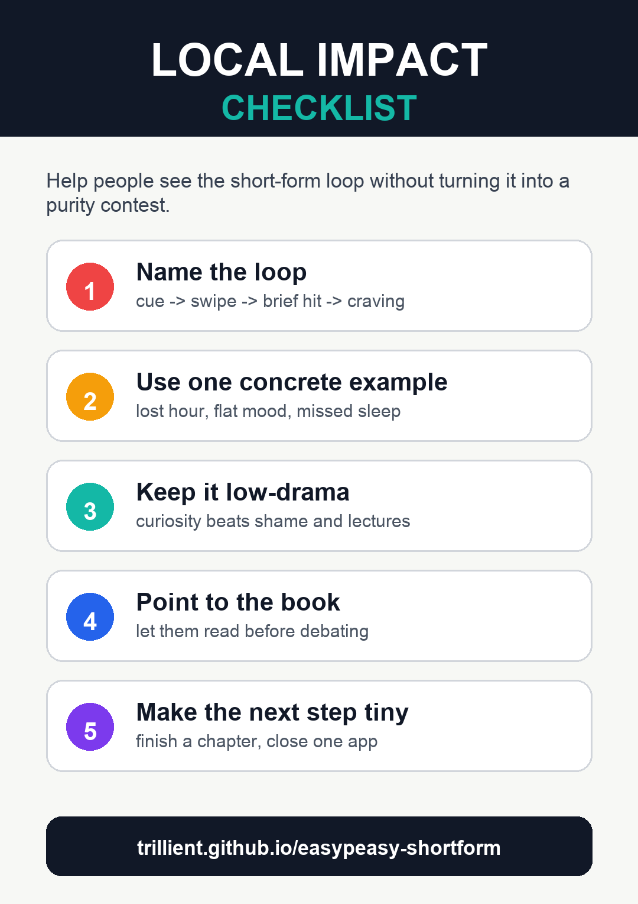

# Now

Welcome to the end of the book, it's lovely having you here.

First, congratulations on quitting! You'll find that life becomes even more beautiful without short-form content, and that quitting opens your eyes to the many ways that it can be.

You're an important part of the world, and right *now* is the only time that exists, and to summarise many different spiritual teachings: you can cause great suffering for yourself by refusing to accept now, and craving for anything else.

It's okay, and healthy, to have goals and to strive towards purpose, but you shouldn't place your personal value in something outside of you, or let yourself be defined by the imagined past or future.

So, be present and attentive to right now -- it's the only place that's real.

As an example of this and a practise throughout the withdrawal period, you'll find a different 'moment of revelation' (or understanding) soon where you have a 'craving' thought about short-form content, and then recognise it *as* a thought caused by short-form content in the first place, and then feel blissful that you're freed from that thought being 'you'.

You can do this with every thought you ever have, like negativity, or ruminating over the past or future, or times you're feeling wonderful too, and enjoy them more presently and fully without your mind hijacking you with displeasure.

You could be on a tropical beach with the waves rolling in, listening to calm music whilst enjoying the sunset, and you could still be in despair through your thinking.

Even now, as you're reading, you can become aware of your body resting in space, and the sounds where you are, and the sphere of light around you, and *know* that this is all these is. Nothing external can add to the serenity you already have. You're not defined by short-form content, or anything else, unless you think your way into it.

Awareness is the most important teaching I can give you, and easypeasy is simply giving you awareness over short-form content and asking you whether you enjoy it; and so, pure awareness itself will give you the answers to any other problem you're facing.

I know this is all a bit 'woo woo', but it's really important, since all the problems that I hear from people (including with easypeasy) is the failure to recognise their own thoughts. Letting minor and major things stress you out by making them a personal problem, or for easypeasy, it's wrestling with the the infinite reasons your mind *will* manufacture as valid for using short-form content -- and many of them might be really strong reasons -- instead of understanding that you can instead just happily drop the rope instead. In fact, all of the problems we face are exactly that, a failure to pay attention and accept the present moment. You may not prefer it, sure, but accepting it fully is the only way forward.

Anyway, the book is being rewritten to give you this understanding, as easypeasy tries to counteract your brainwashing by *telling* you the reasons why you're not enjoying it, instead of us having a conversation and letting you come to the understanding yourself. I'm working on it, and looking forward to chatting in the future, and in the meantime I had to include this (less elegantly written part)

So, on substitutes: accept that urges are only thoughts and body sensations. Notice them, let them pass, and return attention to what you actually chose.

## So, where to now?

You shouldn't change your life because of quitting short-form content -- for example, you can imagine someone purposely hiding their computer to keep themselves away from short-form content out of fear -- but you'll find that dropping something that was only holding you back, and gaining happiness, calmness, attention, and freedom from slavery, tends to help quite a lot in creating a better life you'd love.

You can also use the time and attention you get back to rekindle local communities, build projects, or be present with people around you.

## Sharing easypeasy everywhere

One of the things that makes communities better is freedom from addiction; if you'd like to help spread EasyPeasy Short-Form, there's two things you can do:

- First, **share the idea without being weird about it.**

Use jokes, examples, and personal experience to make the trap obvious. Don't make it a purity contest or a debate club.

- **Creating conversations**

People following this checklist can create better conversations about short-form content and other normalised addictions.

You can also create conversations online, and you should pause to consider all the people who are directly and indirectly affected by short-form content and how you can reach them, and also remember that local impact is the most real, and seeing real impact works best.

----------

Really, it just involves thinking about where people who are affected by short-form content are (so, everyone), and how to reach out to them.

## Fantasy!

Short-form content is the elimination of fantasy, where you are mechanically led to the next dopamine hit through conditioned novelty, trend-chasing, outrage, comparison, and cliffhanger loops. Quitting will raise questions about boredom, identity, taste, and what you actually want to do with your time. Understand that conditioned urges aren't *you* and never could be.

Eliminating fantasy has many societal impacts. You cannot dream of a better future if you are stuck inside a feed that sells you other people's projections. You are sold on dreams rather than dreaming them.

So, I have a favour to ask that might help.

*Could you please take one thing you used to only consume and make something from it instead? Post it somewhere, somewhere funny, or just send it to a friend.*

Yours,

Hackauthor²

[source fork](https://github.com/Trillient/easypeasy-shortform) | [upstream](https://gitlab.com/snuggy/easypeasy)
